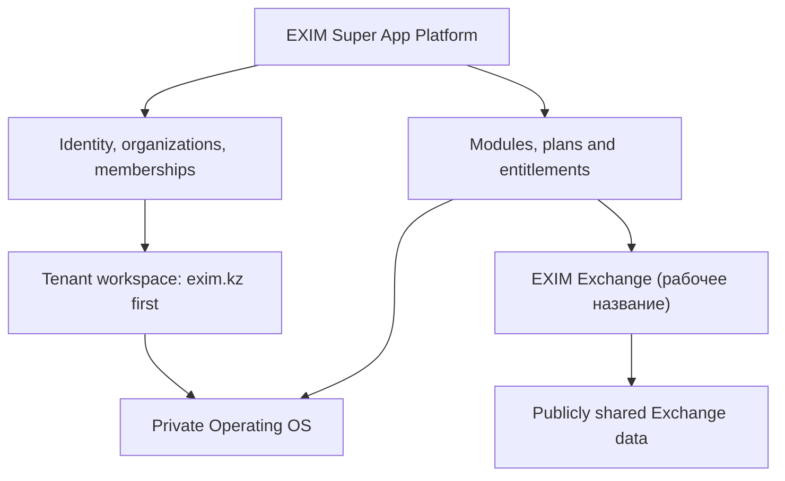

# EXIM Super App Platform Foundation

## ID и цель

**ID:** FOUNDATION-005 
**Статус:** подтверждённая продуктовая основа, технические детали частично `TBD` 
**Цель:** определить устойчивую границу платформы, tenant и двух продуктовых контуров так, чтобы Private OS и Exchange развивались вместе, но не смешивали приватные и публичные данные.

## Платформенная модель

## Уровни

| Уровень | Назначение | Главное правило |
|---|---|---|
| Platform | Общие аккаунты, организации, модули, тарифные права и аудит | Не содержит глобальной «кучи» приватных данных tenants |
| Tenant / workspace | Приватная операционная область логистической компании | Все приватные сущности принадлежат tenant |
| Client portal | Безопасный внешний слой Private OS tenant | Не возвращает себестоимость, маржу, подрядчиков и внутренние комментарии |
| Exchange | Общая зона объявлений и взаимодействия участников | Private/public boundary и механизм публикации определяются после OQ-038; до решения действует предлагаемый safe default |

## Подтверждённые решения

- EXIM Super App должен стать независимой платформой для нескольких компаний.
- `exim.kz` запускает полный Private OS первым.
- Exchange грузов и транспорта является обязательным продуктовым контуром; `EXIM Exchange` — рабочее название.
- Exchange должен присутствовать в целевом первом публичном запуске.
- Организация может совмещать несколько возможностей.
- Доступ к функциям модульный.
- Предусмотрены ограниченный бесплатный и платный уровни.
- Платформа не является стороной сделки между участниками Exchange.
- Поддерживаются основные виды транспорта.

## Границы данных

### Private OS

- данные видны только разрешённым участникам соответствующего tenant;
- клиент tenant получает отдельное безопасное представление;
- внутренние поля не должны попадать в клиентский или Exchange API;
- связь с публичным объявлением не предполагается до OQ-038; если она будет утверждена, её происхождение и public field set должны контролироваться технически.

### Exchange — безопасная рабочая граница

- объявления принадлежат организации-участнику;
- одна организация может публиковать и грузы, и транспорт;
- платформа не является стороной сделки между независимыми участниками; точная юридическая квалификация и формулировки остаются OQ-041;
- точные правила контактов, KYC, модерации и споров остаются открытыми.

## Модульный доступ

Логическая модель должна различать:

- наличие модуля у организации;
- план/тариф;
- лимиты;
- роль пользователя внутри tenant;
- capabilities организации в Exchange;
- конкретные права действия.

Точный биллинг, цены и лимиты не определены. Их нельзя зашивать без решения.

## Что не следует из этой основы

- не утверждена отдельная codebase для Exchange;
- не утверждён отдельный deployable microservice;
- не утверждены KYC-провайдер, платёжный провайдер или ranking;
- не утверждён момент открытия контактов;
- не утверждён порядок выдачи полного Private OS другим компаниям;
- не утверждена юридическая формулировка ответственности платформы.

## Критерии архитектурной готовности Foundation Gate

- `exim.kz` не зашит как единственно возможная организация;
- приватные сущности имеют владельца tenant/workspace;
- отдельные тестовые `TenantWorkspace A/B` не видят данные друг друга;
- membership, роль и entitlement проверяются сервером;
- в рекомендуемой Gate-модели приватный запрос и публичное объявление технически разделены до решения OQ-038;
- до закрытия OQ-038 предлагаемый security default требует отдельной public-сущности, явного действия и allowlist полей; это ещё не подтверждённая продуктовая механика;
- модуль Exchange можно добавить без раскрытия всех внутренних запросов;
- решение о физической архитектуре остаётся заменяемым.

## Связанные решения и вопросы

- D-075…D-083;
- OQ-033…OQ-047;
- [Tenant-модель](../03-product-map/tenant-model);
- [Границы данных](../03-product-map/security-and-data-isolation);
- [Public Launch MVP](../07-mvp/mvp-v1).
