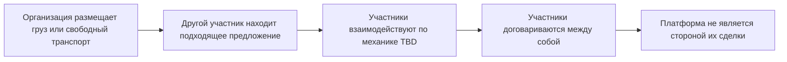

# Процесс EXIM Exchange (рабочее название)

## ID и цель

**ID:** PROCESS-EX-001 
**Статус:** рабочий draft. Подтверждены назначение и границы сервиса; конкретная механика требует решений OQ-038…OQ-043. 
**Цель:** описать минимальную цепочку общей биржи грузов и свободного транспорта без смешивания с Private OS.

## Подтверждённый верхний уровень

## Подтверждённые правила

1. Можно публиковать груз и свободный транспорт.
2. Организация может совмещать обе возможности и другие логистические capabilities.
3. Exchange учитывает автомобильные, ЖД, морские, авиационные и мультимодальные сценарии в применимом объёме.
4. Участники находят друг друга и продолжают взаимодействие.
5. Платформа не является стороной их сделки.
6. Предусмотрен ограниченный бесплатный и платный доступ.
7. Механизм связи Private OS с Exchange не утверждён. До OQ-038 отдельная сущность, opt-in действие и allowlist полей являются рекомендуемым security default.

## Предлагаемый основной сценарий Launch MVP

Ниже — проектная гипотеза, которую нельзя передавать как принятое решение без закрытия OQ-039/OQ-040/OQ-043:

1. Владелец создаёт черновик объявления.
2. После проверки будущего набора обязательных полей объявление становится доступно в поиске.
3. Другой участник отвечает способом, который будет утверждён в OQ-040.
4. Владелец выбирает дальнейшее взаимодействие.
5. Контакты раскрываются только по будущему правилу OQ-043.
6. Участники продолжают договорённость вне роли платформы как стороны сделки.

## Возможные альтернативные сценарии — draft

- объявление не прошло проверку обязательных полей;
- объявление приостановлено владельцем;
- нет откликов до истечения срока;
- отклик отозван;
- владелец отклонил отклик;
- объявление или участник заблокирован модерацией;
- найденный участник отказался до заключения собственной сделки.

## Данные верхнего уровня — draft

### Объявление о грузе

- владелец-организация;
- маршрут;
- груз и основные параметры;
- даты;
- вид транспорта;
- условия и публичный комментарий;
- статус;
- срок публикации;
- правила видимости контактов.

### Объявление о транспорте

- владелец-организация;
- тип транспорта/вместимости;
- доступный маршрут или география;
- доступные даты;
- грузовые ограничения;
- условия и публичный комментарий;
- статус;
- срок публикации;
- правила видимости контактов.

Точные поля по видам транспорта — OQ-042.

## Не утверждено

- точная модерация и KYC;
- рейтинги и отзывы;
- ranking результатов;
- формат торгов;
- момент и условия открытия контактов;
- встроенная оплата;
- договорные шаблоны между участниками;
- обработка споров;
- точные тарифные лимиты;
- физическая microservice-архитектура.

## Рекомендуемый критерий продуктовой готовности

Для планирования предлагается принимать Exchange-часть Launch MVP после утверждения и прохождения минимумов REQ-007…REQ-009, закрытия критических юридических и продуктовых вопросов и проверки двумя независимыми организациями. Обязательность и минимальный объём REQ-010 зависят от OQ-039…OQ-041.
