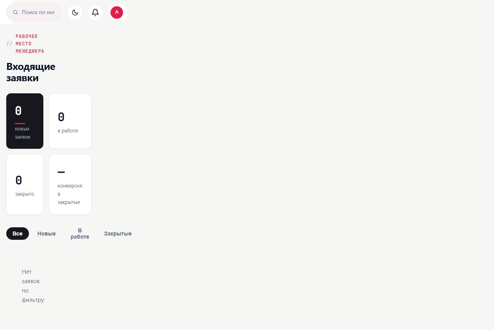
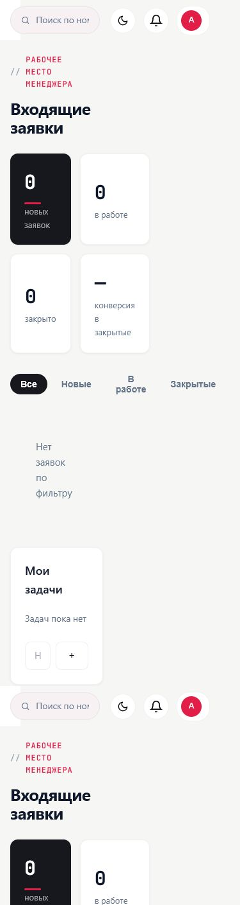
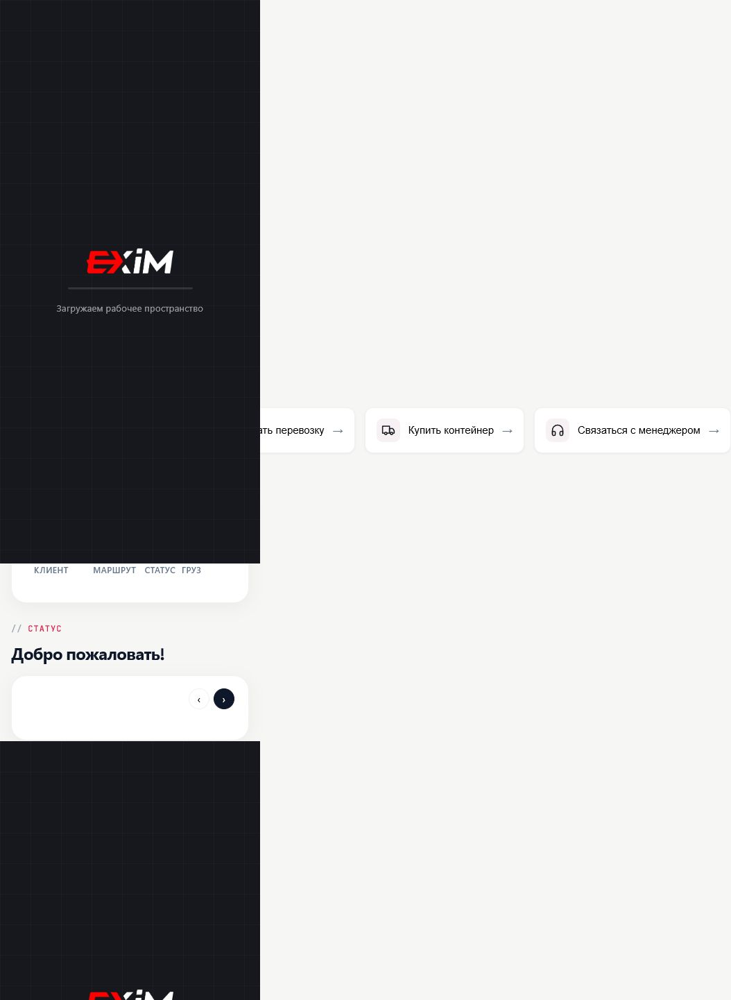
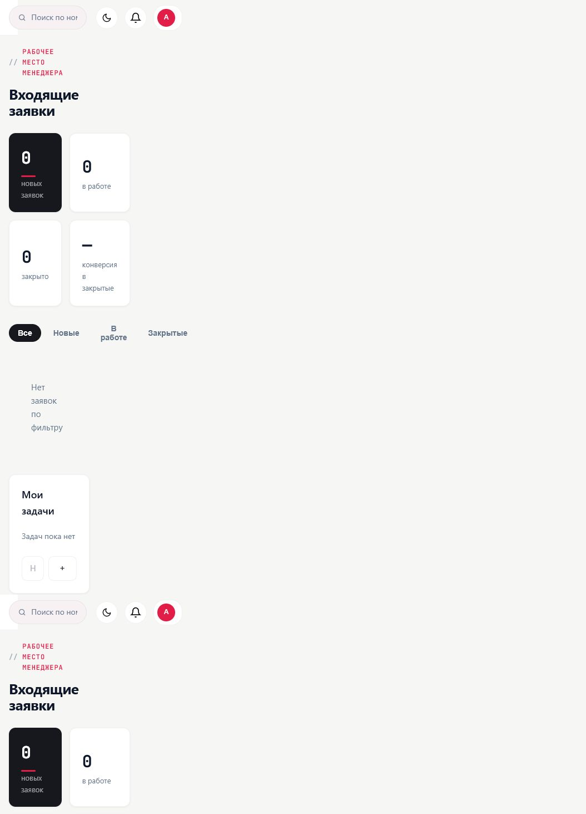

# Production Technical Recon 2026-07-27

## Scope

Read-only technical reconnaissance of the published EXIM app at <https://exim-super-app.vercel.app/app>.

The investigation used the built-in Browser and public browser-served production bundles only. Application code was not changed, production data was not changed, no new requests or shipments were created, no messages were sent, no payments were made, and no user rights or company settings were changed.

This report continues the evidence in [Vercel audit 2026-07-27](2026-07-27-vercel-audit) and [Bug Registry](../bug-registry).

## Limitations

- No `exim-app` repository was available in the workspace.
- No separate confirmed test accounts were available for client, logistician and administrator.
- The authenticated Browser session exposed a manager-visible app, but the server role was not verified through a safe API body.
- Cookies, tokens, credentials and storage values were not read, saved or printed.
- Network request bodies and auth headers were not documented.
- Public minified/source bundles were inspected only for framework, routing, module and provider signals; large code excerpts were not copied into Product OS.

## Real Navigation Model

The production app exposes a real protected document route at `/app`. The sidebar does not navigate to `/app/requests`, `/app/shipments`, `/app/tracking` and similar document routes. In the authenticated DOM, sidebar links use hash-style hrefs:

- `#dashboard`
- `#shipments`
- `#workflow`
- `#crm`
- `#analytics`
- `#chats`
- `#tasks`
- `#tracking`
- `#containers`
- `#services`
- `#inbox`
- `#margin`
- `#profile`

The public `exim/app.js` bundle defines an internal `APP_STATE.currentPage` and a `navigate(page, ...)` function that hides all `.page` elements and activates `#page-<page>`. This means most app sections are implemented as one-page SPA state inside `/app`, not as independent URL routes.

Direct `/app/requests` rendered a real Next.js 404 page in the authenticated Browser:

- URL: `https://exim-super-app.vercel.app/app/requests`
- Title: `404: This page could not be found.`
- Body: `404 / This page could not be found.`
- App nav count: `0`

Unauthenticated HTTP checks returned `307 Temporary Redirect` for `/app` and the tested `/app/*` paths. The Browser view shows that once authenticated, `/app/requests` is not rewritten back to the app shell; it remains a true 404 document.

Conclusion: this is [GAP-001](../gap-registry#gap-001), a confirmed architecture gap. `/app/requests` is not an implemented route, so its 404 is not classified as a standalone High bug and does not prove that routing is broken. Product OS and implementation need an explicit decision: SPA-only hash/internal navigation or path-based routes.

## Frontend And Framework Observations

Confirmed from browser-served assets:

- The protected app is delivered by Next.js. Evidence: `_next/static/chunks/...` assets and a Next 404 page for `/app/requests`.
- The `/app` route loads a small Next page chunk and then public scripts under `/exim/`.
- Observed app scripts: `/exim/leaflet.js`, `/exim/app.js`, `/exim/workflow.js`, `/exim/modules.js`, `/exim/crm.js`.
- No separate React Router or document routes for each EXIM section were proven from the served assets.
- The application has public module names and globals for workflow, CRM, tasks, docs and app state.

Public bundle signals:

- `workflow.js` contains request workflow and shipment workflow logic.
- `modules.js` contains analytics, chats, tasks and profile-related modules.
- `crm.js` contains CRM lead/funnel UI.
- `app.js` contains the central app state, navigation, dashboard, profile, documents and local persistence helpers.

## Auth And Backend Observations

Confirmed from public browser-served code and UI:

- The app references Supabase concepts/globals: `window.__SUPA`, `window.__EXIM`, `window.__EXIM_DOCS`.
- The workflow bundle comments indicate Supabase and database RLS as the intended permission layer.
- The app page initializes role/mode from `window.__EXIM.role`.
- Client-side code stores some non-auth app data under localStorage keys such as `exim-settings`, `exim-profile`, `exim-notifs-v2`, `exim-chats`, `exim-data-v2`, `exim-tasks`, `exim-lang`, `exim-theme` when those features are used.

Not documented: Supabase project URLs, anon keys, cookies, tokens, session values and API response bodies.

## Loading-Only Investigation

Three reloads of `/app` were tested in the authenticated Browser after clearing the observation context without clearing auth state:

1. Direct `/app`: manager dashboard rendered.
2. Reload 1: manager dashboard rendered.
3. Reload 2: manager dashboard rendered with the boot text still present before/inside the page text.
4. Reload 3: client dashboard rendered with the boot text still present and body role unset.

After Back/Forward involving the app and the Browser attach page, `/app` reached a loading-only state:

- URL: `/app`
- Title: `EXIM Super App`
- Body: `Загружаем рабочее пространство`
- Role buttons: not visible
- Sidebar: not visible
- Console: no EXIM application errors captured by Browser logs

Most exact current category: confirmed intermittent client bootstrap/state initialization failure. The HTML and JavaScript load, but the app can fail to complete protected workspace initialization after reload or navigation history transitions. This is BUG-001. Without `exim-app` source, server logs or safe Network request bodies, the exact request or exception causing the loading-only state is not provable.

## Role And View-State Investigation

### Server Role

The public code reads `window.__EXIM.role` as the server-provided role. The value itself was not printed or stored. The UI repeatedly rendered manager dashboard content and an active `Менеджер` button, so the session is manager-visible.

### UI Mode

The public workflow code computes an effective role from both `window.__EXIM.role` and `APP_STATE.currentRole`. Staff roles can view `client`, `manager` or `logist` modes through the role switcher, while a pure client is forced to client mode.

### Active Visual Button

Observed active button states varied without intentional role switching:

- Most runs: active `Менеджер`, body role `manager`, manager dashboard.
- One reload: active `Клиент` plus `RU`, body role unset, client dashboard.
- Later state: active `Менеджер` again.
- Loading-only state: no role button visible.

Conclusion: the role switcher is at least partly a view-mode control. The observed instability should be classified as UI/view-state instability, not as a confirmed RBAC violation.

### Proven Access To Functions

Proven in the current session: manager-visible dashboard, sidebar sections inside `/app`, read-only opening of workflow, shipments, tracking and other sections when the app shell renders, and previously created `CODEX-AUDIT` evidence in the request workflow.

Not proven: independent client, logistician or administrator server-role access; server-side permission boundaries; role mutation or privilege escalation.

## Kanban Investigation

Public workflow code shows the request list/kanban switch is a client-side state toggle:

- `CACHE.view !== 'kanban'` marks `Список` active.
- `CACHE.view === 'kanban'` marks `Канбан` active.
- `WF.view(v)` sets `CACHE.view = v` and calls `renderWF()`.
- The kanban board is rendered only when `CACHE.view === 'kanban' && os.length`.

This gives a concrete explanation for one visible failure mode: if the request collection is empty or failed to load, clicking `Канбан` can activate the state but still not render a board.

Observed Browser behavior:

- Earlier authenticated audit: kanban columns rendered for `CODEX-AUDIT`.
- Later audit pass: clicking `Канбан` left the table visible, URL stayed `/app`, and no query/hash change was observed.
- Final technical pass could not complete the full click matrix because `/app` became unstable after Back/Forward and sometimes rendered loading-only or client mode.

Most likely category: client state changes are local and not reflected in URL; board rendering is blocked when workflow data is empty/unloaded. The previously observed table-stays-visible case remains partially confirmed until source access or a stable seeded dataset can prove whether the handler ran.

## Mobile Overflow Investigation

Viewports checked:

- 390x844
- 375x812
- 360x800

Findings:

- At one 390px run, manager dashboard rendered without page-level overflow, but bottom navigation icons were positioned beyond the viewport.
- At 375x812 and 360x800 runs, the UI rendered client dashboard/view-mode content and page-level horizontal overflow was confirmed.
- Measured page width: approximately `1054px` scroll width against mobile client widths around `360px`.
- Primary overflowing block: the quick-action dashboard row containing `.dash-link` buttons such as `Рассчитать перевозку`, `Купить контейнер`, `Связаться с менеджером`.
- The `.dash-link` buttons were positioned horizontally at x offsets around 252px, 526px and 770px, with the last button extending to about 1054px.

Likely CSS cause: a non-wrapping horizontal quick-action layout or carousel/grid that contributes to document-level width instead of being constrained inside an internal scroll container.

The issue reproduced inside protected `/app`. Public login/register screens were not part of this overflow measurement and had previously rendered without the same protected-dashboard overflow.

## Confirmed

- BUG-001: `/app` intermittently remains at `Загружаем рабочее пространство`; HTML and JavaScript load, but protected workspace bootstrap does not always complete.
- GAP-001: `/app` is the real protected shell route, sidebar navigation is hash/internal-state based, and `/app/requests` is not an implemented route.
- Public production bundles confirm Next.js plus separate `/exim/*.js` app scripts.
- Public scripts reference Supabase-backed globals.
- Role display is split between server role and client-side view mode.
- Mobile client dashboard/view-mode can create document-level horizontal overflow through `.dash-link` quick actions.

## Hypotheses

- Loading-only state is caused by an intermittent bootstrap race between Next auth/session hydration and the legacy `/exim/*.js` app initialization.
- Kanban inconsistency is caused by empty/unloaded workflow data or by local state reset during re-render, not by a server request.
- Client-mode rendering after reload may occur when `window.__EXIM` is missing or late while `/exim/app.js` falls back to client defaults.

## Not Provable Without `exim-app`

- Exact Next.js routing configuration and Vercel rewrite/fallback rules.
- Exact auth middleware behavior.
- Server-side role assigned to the current user.
- Supabase RLS policies.
- API endpoints, schema and backend error causes.
- Whether mocked/localStorage data is mixed with production data.
- Exact CSS source rule responsible for mobile overflow.
- Whether Kanban handler always fires in production.

## Recommendations To Integrator

1. Decide and document the intended navigation contract: single `/app` shell with hash/state, or real routes matching Product OS page registry.
2. If SPA-only navigation remains the MVP contract, test direct `/app#workflow`, `/app#shipments`, `/app#tracking` and reload restoration instead of assuming `/app/requests`.
3. Add a safe non-secret audit endpoint or UI debug field for test environments that exposes server role and selected view mode separately.
4. Make role switcher labels explicit as view modes when staff can preview client/logistician views.
5. Persist or intentionally reset workflow view mode, and render a clear empty kanban state when there are no orders.
6. Add mobile regression tests asserting `document.documentElement.scrollWidth <= document.documentElement.clientWidth` for protected dashboards at 390, 375 and 360 widths.
7. Provide a sandbox dataset with one client, request, rate, shipment, trip, tracking event, document and notification for end-to-end Product OS certification.

## Evidence Screenshots

