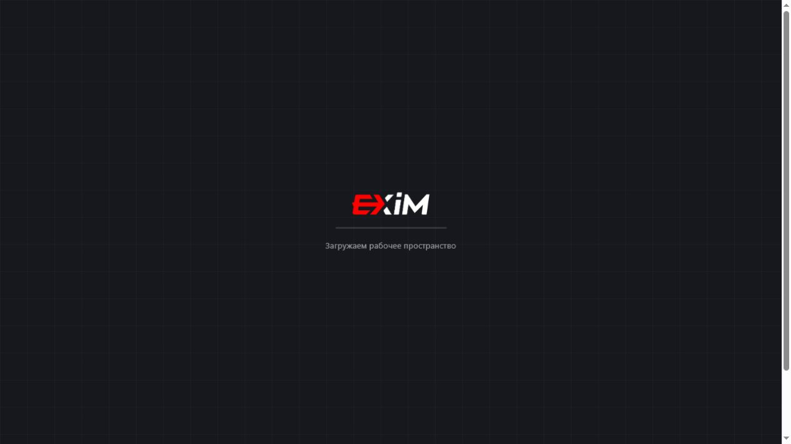
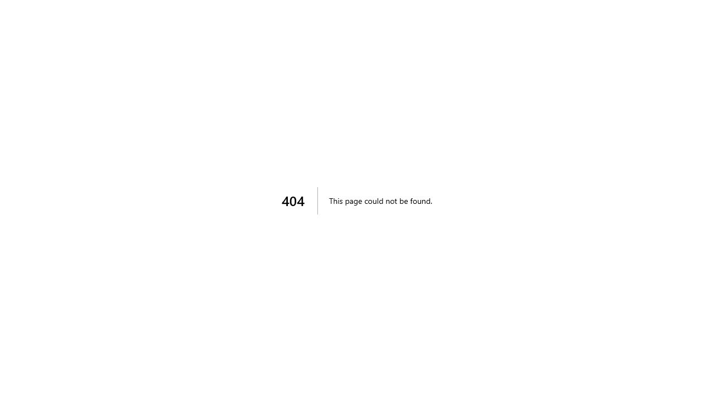
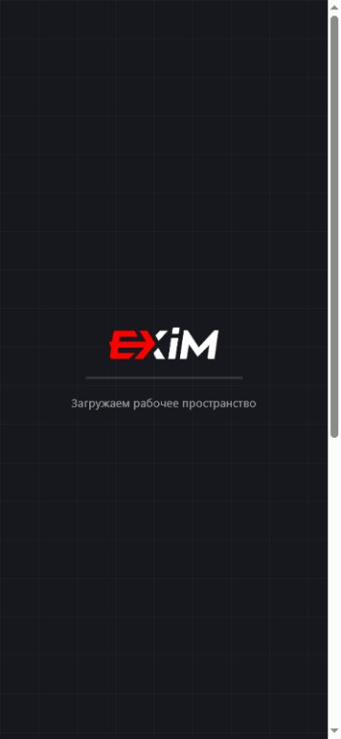
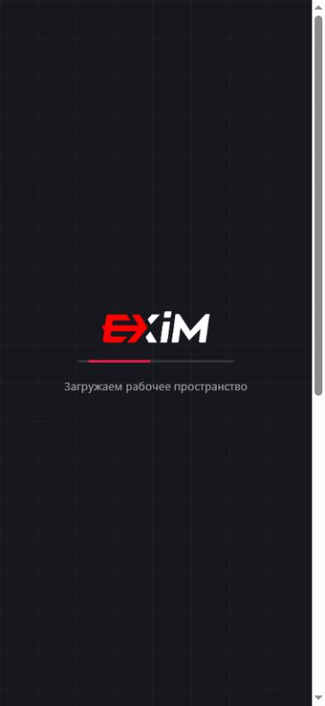

# Bug Registry

Дата расследования: 2026-07-27  
Окружение: published Vercel app, built-in Browser, authenticated session previously available for manager audit.

## Scope and safety

- Код опубликованного приложения не изменялся.
- Рабочие данные не изменялись.
- Новые заявки и перевозки не создавались.
- Существующая тестовая заявка `CODEX-AUDIT` использовалась только как ранее созданное доказательство.
- Cookies, tokens, credentials and browser storage values were not read, stored or printed.

## BUG-001

- ID: BUG-001
- Название: Direct `/app/*` routes do not restore authenticated app pages.
- Статус: Confirmed
- Серьёзность: High
- Затронутая роль: manager-visible authenticated app; unauthenticated request layer.
- Окружение: `https://exim-super-app.vercel.app`, Vercel production.
- Предусловия: published app is available; Browser had previously entered protected `/app` during manager audit.

### Шаги воспроизведения

1. Open `/app` via the app root.
2. Open sections through the sidebar menu: `Заявки`, `Перевозки`, `Отслеживание`, `CRM`, `Чаты`, `Профиль`.
3. Open direct URLs manually: `/app/requests`, `/app/shipments`, `/app/tracking`, `/app/clients`, `/app/chat`, `/app/settings`, `/app/admin`.
4. Reload direct URLs.
5. Use Back/Forward after direct URLs.
6. Check HTTP status with unauthenticated GET.
7. Check Browser console logs without exposing tokens or personal data.

### Фактический результат

- Menu navigation works inside `/app` as an SPA state.
- Direct `/app/requests`, `/app/shipments`, `/app/tracking`, `/app/clients`, `/app/chat`, `/app/settings`, `/app/admin` show a real `404: This page could not be found.` page in the Browser.
- Direct `/app` degraded to `Загружаем рабочее пространство` without visible sidebar or role controls after direct route testing.
- Unauthenticated HTTP GET returned `307 Temporary Redirect` for `/app` and all tested `/app/*` paths.
- Browser console did not show EXIM application errors in the captured checks; observed warnings were from the Browser/Codex telemetry environment.
- Failed Network requests for the app could not be enumerated with the available Browser API without source access or token disclosure.

### Ожидаемый результат

Each documented page route should either render the correct protected page after auth or redirect consistently to login. Reload and Back/Forward should not produce a real 404 for valid Product OS pages.

### Частота воспроизведения

Reproduced for every direct `/app/*` route listed above during the investigation.

### Доказательства

- Screenshot: 
- Screenshot: 
- HTTP status check without auth: `/app`, `/app/requests`, `/app/shipments`, `/app/tracking`, `/app/clients`, `/app/chat`, `/app/settings`, `/app/admin` returned `307 Temporary Redirect`.

### Связанные требования

- [Карта приложения](../03-product-map/app-map)
- [Реестр страниц](../04-pages/page-registry)
- [Права и видимость](../03-product-map/permissions)
- [MVP v1](../07-mvp/mvp-v1)

### Ограничения расследования

- Authenticated document HTTP status could not be read directly from Browser navigation.
- No `exim-app` repository was available to inspect routing config.

### Рекомендуемая проверка после исправления

Run direct navigation, reload, Back and Forward for every route in the page registry under an authenticated test user and assert that valid pages render the app shell instead of 404.

## BUG-002

- ID: BUG-002
- Название: Role and interface mode state are not reliably explainable from visible UI.
- Статус: Partially confirmed
- Серьёзность: Medium
- Затронутая роль: manager; possible client-mode visual state.
- Окружение: published Vercel app, built-in Browser.
- Предусловия: authenticated session exists; role buttons `Клиент`, `Менеджер`, `Логист` are visible.

### Шаги воспроизведения

1. Open `/app`.
2. Record visually active role button.
3. Reload `/app`.
4. Open direct `/app` after visiting `/app/tracking`.
5. Navigate between sidebar sections.
6. Use Back/Forward.
7. Compare visible active role button, available sidebar sections and dashboard content.

### Фактический результат

- During the authenticated audit the visible active role was usually `Менеджер`, with manager dashboards such as `Рабочее место менеджера` and `Входящие заявки`.
- One pass after direct `/app` navigation showed `Клиент` as the active visual button while the same broad sidebar remained available.
- Later checks without intentional role switching again showed `Менеджер` active.
- After direct route testing `/app` could get stuck at `Загружаем рабочее пространство`, hiding role buttons entirely.

### Ожидаемый результат

The app should expose a consistent, auditable separation between confirmed server role, selected interface mode and visual active button. Reload and direct navigation should not make the active role ambiguous.

### Частота воспроизведения

Partially reproduced. The transient `Клиент` visual state was observed once; manager state was observed repeatedly.

### Доказательства

- Screenshot: 
- Screenshot: 
- Prior audit notes recorded both visual states without manual role switching.

### Связанные требования

- [Роли](../02-process/roles)
- [Права и видимость](../03-product-map/permissions)
- [Карта приложения](../03-product-map/app-map)

### Ограничения расследования

- Server role was not independently confirmed from a safe API response.
- Browser storage and tokens were not inspected.
- This is not classified as an RBAC violation without source/API evidence.

### Рекомендуемая проверка после исправления

Add a safe `/me` or profile endpoint for test audits that returns role/mode metadata without secrets, then compare it against visible role buttons after login, reload, direct navigation and Back/Forward.

## BUG-003

- ID: BUG-003
- Название: `Список` / `Канбан` view switch is unstable in requests workflow.
- Статус: Partially confirmed
- Серьёзность: Medium
- Затронутая роль: manager.
- Окружение: `/app`, `Заявки`, published Vercel app.
- Предусловия: authenticated manager app shell is available; request list contains the test request `CODEX-AUDIT`.

### Шаги воспроизведения

1. Open `/app`.
2. Navigate through menu to `Заявки`.
3. Click `Список`.
4. Click `Канбан`.
5. Click `Канбан` again.
6. Click `Список`.
7. Reload after selecting a view.
8. Check whether URL, query string, DOM structure or CSS-hidden content changes.
9. Repeat at desktop and mobile viewport widths.

### Фактический результат

- Earlier authenticated audit saw the `CODEX-AUDIT` request in kanban columns.
- A later repeat showed that clicking `Канбан` left the table visible: `hasTable=true`, `hasKanban=false`, URL stayed `/app`.
- During this investigation, direct route testing left `/app` stuck at `Загружаем рабочее пространство`, so the full matrix of list/kanban checks could not be completed again without re-authenticating or source access.

### Ожидаемый результат

`Канбан` should consistently switch to visible kanban columns, `Список` should consistently switch to the table, and the selected view should have deterministic persistence rules after reload.

### Частота воспроизведения

Partially reproduced across audit passes. The inconsistent behavior was observed, but the post-direct-route loading state blocked a full repeat in the final investigation pass.

### Доказательства

- Screenshot: 
- Recorded audit result: `Список` and `Канбан` buttons both left table visible in one repeat.

### Связанные требования

- [REQ-003](../06-requirements/REQ-003-configurable-workflow-mvp)
- [Configurable Workflow Foundation](../01-foundation/configurable-workflow-foundation)
- [Кабинет менеджера](../04-pages/manager-cabinet)

### Ограничения расследования

- Source code was unavailable.
- No safe network inspector for app requests was available in Browser.
- The app shell became unavailable after direct route testing.

### Рекомендуемая проверка после исправления

Create an automated UI test that seeds one `CODEX-AUDIT` request, toggles `Список` and `Канбан`, checks visible DOM columns/table and verifies behavior after reload at desktop and mobile widths.

## BUG-004

- ID: BUG-004
- Название: Mobile `/app` dashboard shows horizontal overflow.
- Статус: Partially confirmed
- Серьёзность: Medium
- Затронутая роль: manager.
- Окружение: built-in Browser viewport checks at 390x844, 375x812 and 360x800.
- Предусловия: authenticated app shell can render manager dashboard.

### Шаги воспроизведения

1. Open authenticated `/app`.
2. Set viewport to 390x844.
3. Observe dashboard and horizontal page scroll.
4. Repeat at 375x812.
5. Repeat at 360x800.
6. Compare login/register with `/app`.

### Фактический результат

- Prior authenticated mobile screenshot at 390x844 showed the manager dashboard with a bottom horizontal scrollbar.
- In the final investigation pass, direct `/app` was stuck at `Загружаем рабочее пространство` at 390x844, 375x812 and 360x800, so the dashboard overflow could not be re-measured live on all three sizes.
- Public login mobile had previously rendered without horizontal overflow; the problem appears scoped to protected `/app` shell/dashboard when it renders.

### Ожидаемый результат

Protected `/app` should fit within viewport width at 390x844, 375x812 and 360x800 without page-level horizontal scroll, and all navigation/actions should remain reachable.

### Частота воспроизведения

Partially confirmed: confirmed at 390x844 in prior authenticated audit; final pass confirmed mobile direct `/app` loading failure at all three requested sizes rather than the dashboard overflow itself.

### Доказательства

- Screenshot: 
- Screenshot: 
- Screenshot: 
- Screenshot: 

### Связанные требования

- [Product Foundation](../01-foundation/product-foundation)
- [Карта приложения](../03-product-map/app-map)
- [MVP v1](../07-mvp/mvp-v1)

### Ограничения расследования

- The authenticated app shell did not re-render during final mobile checks.
- Exact overflowing DOM element could not be identified without source access or a stable rendered dashboard in the final pass.

### Рекомендуемая проверка после исправления

Run responsive tests at 390x844, 375x812 and 360x800 against a stable authenticated dashboard and assert `document.documentElement.scrollWidth <= window.innerWidth`.
