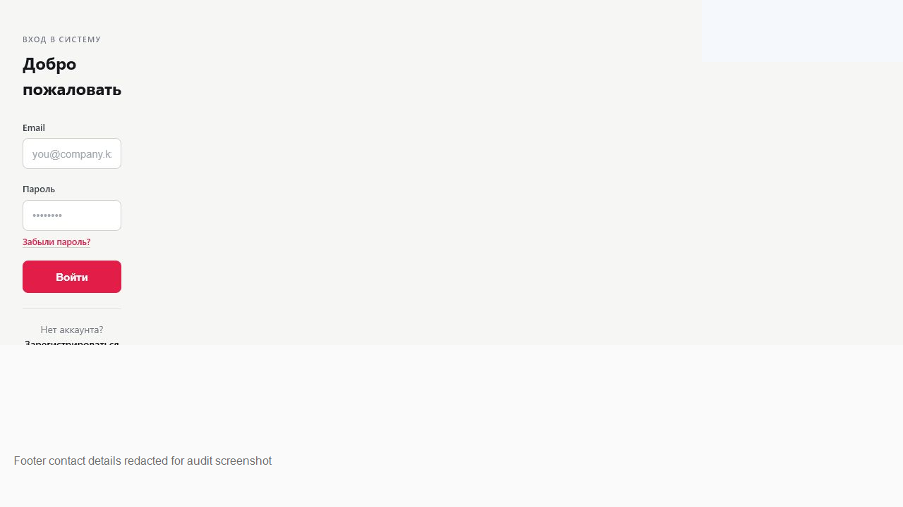
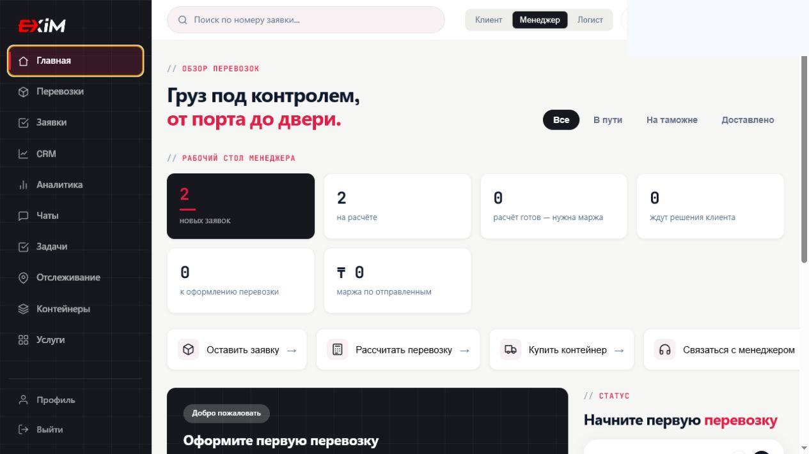
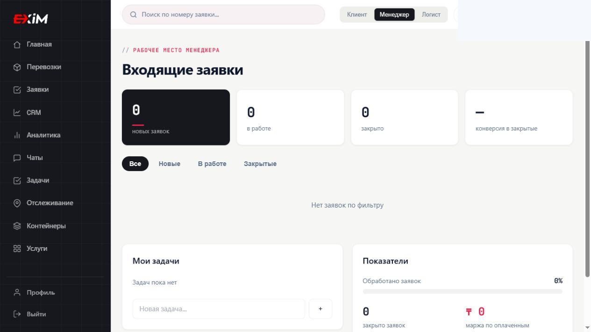
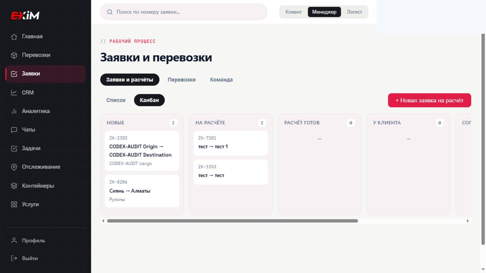
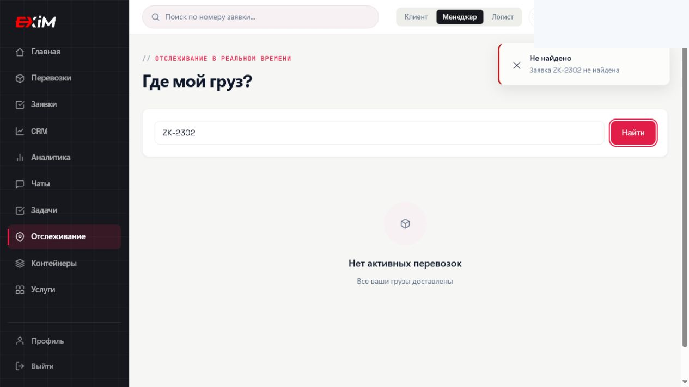
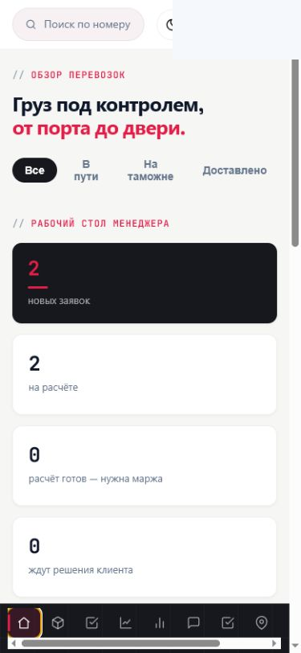

# Текущее состояние опубликованного приложения

Дата внешнего аудита: 2026-07-27  
Приложение: <https://exim-super-app.vercel.app/app>
Версия Product OS: 0.4.0 - draft

## Цель

Зафиксировать наблюдаемое состояние опубликованного приложения и сравнить его с EXIM Product OS. Код приложения не изменялся, данные не удалялись, реальные сообщения не отправлялись, оплаты не проводились.

## Ограничения аудита

- Нет полного набора подтверждённых тестовых аккаунтов ролей: клиент, менеджер, логист, администратор.
- Репозиторий приложения `exim-app` в рабочей папке недоступен, поэтому исходный код, backend, база данных, API, auth policies, Vercel-конфигурация, mock-данные и env-переменные не проверялись.
- Первичный аудит проверял только публичную auth-часть; продолжение аудита расширило область до одной текущей авторизованной сессии.
- Фактически доступная роль в этой сессии: **менеджер**. Другие роли не предполагались и не проверялись через переключение ролей.
- Логин, пароль, cookies, токены и значения `localStorage`/`sessionStorage` не сохранялись, не читались и не выводились.

## Связь с Product OS

Проверка сопоставлялась с [Product Foundation](../01-foundation/product-foundation), [Configurable Workflow Foundation](../01-foundation/configurable-workflow-foundation), [Ролями](../02-process/roles), [картой приложения](../03-product-map/app-map), [правами и видимостью](../03-product-map/permissions), [реестром страниц](../04-pages/page-registry), [MVP v1](../07-mvp/mvp-v1), [REQ-003](../06-requirements/REQ-003-configurable-workflow-mvp) и [открытыми вопросами](../09-decisions/open-questions).

## Проверенные публичные страницы

- `/login` отображается.
- `/register` отображается; тестовая регистрация дошла до экрана подтверждения email.
- `/forgot-password` отображается; отправка письма не выполнялась.
- `/verify` отображается; повторная отправка письма не выполнялась.
- `/app` без сессии перенаправляет на `/login`.

## Авторизованная сессия

После входа текущая роль определена как **менеджер** по активной кнопке роли `Менеджер` и менеджерским блокам dashboard. Сессия сохранилась после обновления `/app`: приложение осталось в защищённой зоне.

Повторная проверка в продолжении аудита подтвердила текущую роль **менеджер**: активна кнопка `Менеджер`, на главной отображается `Рабочее место менеджера` и dashboard `Входящие заявки`. Один раз после прямого возврата на `/app` Browser зафиксировал активную кнопку `Клиент`, но последующее состояние без ручного переключения снова вернулось к `Менеджер`. Это отмечено как нестабильность UI/state, а не как подтверждённый доступ к роли клиента.

Доступное боковое меню в текущей роли: Главная, Перевозки, Заявки, CRM, Аналитика, Чаты, Задачи, Отслеживание, Контейнеры, Услуги, Профиль, Выйти.

Верхняя панель содержит поиск по номеру заявки, кнопки ролей `Клиент`, `Менеджер`, `Логист`, переключатель темы, уведомления и профиль. Кнопки переключения ролей не нажимались, чтобы не менять роль и права.

## Проверенные разделы текущей роли

| Раздел | URL | Что загружается | Фактическое состояние |
|---|---|---|---|
| Главная | `/app` | Обзор перевозок, рабочий стол менеджера, KPI, быстрые действия | Работает частично: экран загружается, но состав не полностью совпадает с Product OS manager dashboard |
| Перевозки | `/app`, меню `#shipments` | Пустой список перевозок, фильтры, кнопка `+ Новая заявка` | Работает частично: список пуст, создание перевозки небезопасно проверять из-за подтягивания существующих реквизитов |
| Заявки | `/app`, меню `#workflow` | Заявки и расчёты, список/канбан, тестовая заявка | Работает частично: создание и сохранение заявки работают, смена этапа не обнаружена |
| CRM | `/app`, меню `#crm` | Заголовок CRM, вкладки воронки/списка, кнопка нового лида | Только интерфейс |
| Аналитика | `/app`, меню `#analytics` | Заголовок показателей | Только интерфейс |
| Чаты | `/app`, меню `#chats` | Заголовок и кнопка `+ Новый чат` | Только интерфейс; сообщения не отправлялись |
| Задачи | `/app`, меню `#tasks` | Заголовок задач | Только интерфейс |
| Отслеживание | `/app`, меню `#tracking` | Поиск по номеру заявки, пустое состояние активных перевозок | Работает частично: поиск показывает `Не найдено` для тестовой заявки |
| Контейнеры | `/app`, меню `#containers` | Каталог контейнеров, фильтры, кнопка продажи контейнера | Только интерфейс относительно Product OS scope |
| Услуги | `/app`, меню `#services` | Каталог услуг и фильтры, включая `Документы` | Только интерфейс; документов как сущностей нет |
| Профиль | `/app`, меню `#profile` | Форма компании и контактного лица | Работает частично; сохранение профиля не проверялось, чтобы не менять рабочие данные |

Прямые защищённые URL `/app/clients`, `/app/requests`, `/app/shipments`, `/app/documents`, `/app/chat`, `/app/notifications`, `/app/settings`, `/app/admin`, `/app/logistics`, `/app/rates`, `/app/tracking` в авторизованной сессии открылись как пустые страницы без заголовков и действий. Основная навигация фактически реализована внутри одного `/app`.

## Проверенные сценарии

### Запрос на расчёт

Создана тестовая заявка с префиксом `CODEX-AUDIT`: маршрут `CODEX-AUDIT Origin` -> `CODEX-AUDIT Destination`, груз `CODEX-AUDIT cargo`, статус после создания `Новая`. Заявка появилась в списке и в канбане, после обновления страницы сохранилась.

Карточка тестовой заявки открывалась из списка и показывала назначение логиста, deadline и действие `Назначить и отправить на расчёт`. Кнопка не нажималась: действие могло назначить реального пользователя или создать рабочую задачу. Изменение доступного этапа поэтому осталось в статусе `Невозможно проверить`/`Невозможно безопасно проверить`.

Переключатель `Канбан` работал нестабильно: ранее карточка `CODEX-AUDIT` отображалась в kanban-колонках, при повторной проверке нажатие `Канбан` оставляло табличное представление.

### Перевозка и tracking

Создание перевозки не выполнялось. Кнопка `+ Новая заявка` в разделе перевозок открывает форму с существующими данными отправителя и полями реквизитов, поэтому действие могло затронуть реальные рабочие данные.

Поиск в tracking по тестовой заявке вернул `Не найдено`; активная перевозка из созданной заявки не сформировалась. Добавление tracking-события, история события и публикация менеджером не проверены: нет безопасной тестовой перевозки.

## Developer Mode

- В console logs приложения во время проверенных действий не зафиксированы ошибки приложения.
- Во время работы Browser наблюдались сетевые предупреждения служебной среды Codex/Browser к внешнему telemetry-домену; они не отнесены к EXIM.
- Network-ответы API и backend-эндпоинты приложения не удалось полноценно классифицировать без исходного кода и без раскрытия токенов/session storage.
- Прямые `/app/*` маршруты в авторизованной сессии показали пустые экраны, что похоже на отсутствие роутинга для этих URL или SPA-only реализацию через внутреннее состояние.

## Скриншоты

