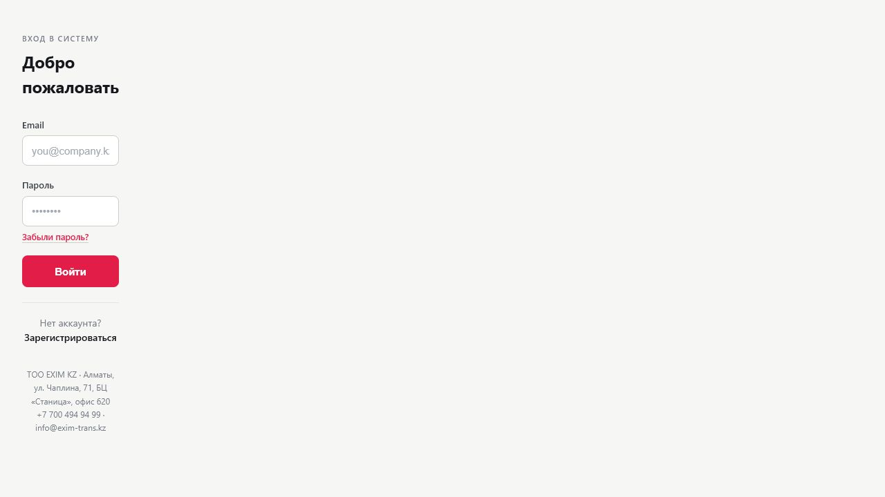
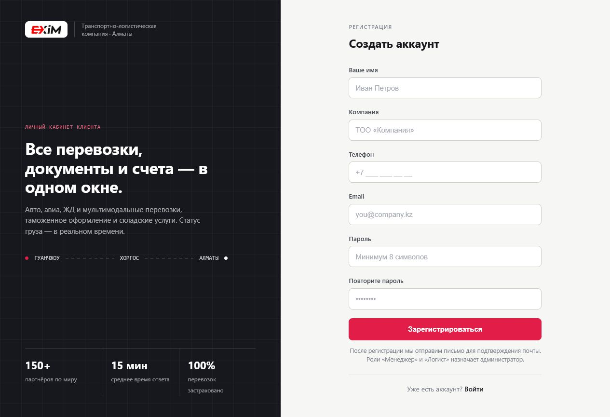
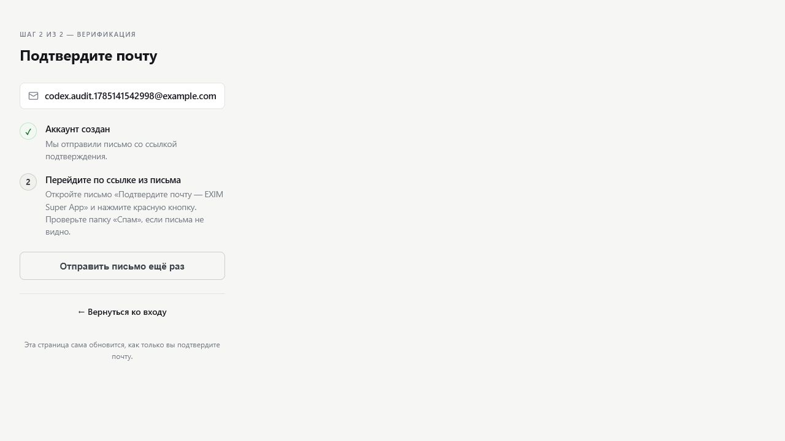
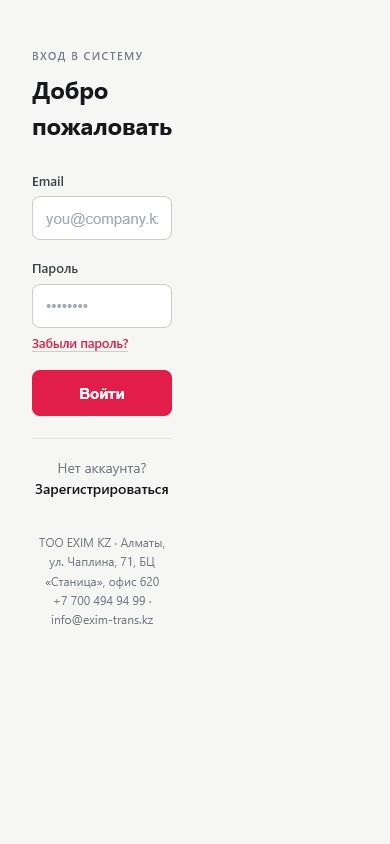

# Текущее состояние опубликованного приложения

Дата внешнего аудита: 2026-07-27  
Приложение: <https://exim-super-app.vercel.app/app>

## Цель

Зафиксировать наблюдаемое состояние опубликованного приложения и сравнить его с Product OS на уровне доступной публичной части.

Это не аудит исходного кода приложения: репозиторий приложения не был доступен. Защищённая часть приложения также не была проверена, потому что не были предоставлены подтверждённые тестовые аккаунты ролей.

## Связь с Product OS

Публичный вход и защищённый доступ проверялись на фоне следующих требований Product OS:

- ценность клиента: личный кабинет, запросы, перевозки, документы, чат и уведомления — [Product Foundation](../01-foundation/product-foundation);
- роли клиента, менеджера, логиста и администратора — [Роли](../02-process/roles);
- клиентский и внутренний слой данных — [Два слоя данных](../03-product-map/data-layers);
- карта клиентского, менеджерского, логистического и административного кабинетов — [Карта приложения](../03-product-map/app-map);
- страницы MVP — [Реестр страниц](../04-pages/page-registry);
- workflow и клиентская видимость этапов — [Configurable Workflow Foundation](../01-foundation/configurable-workflow-foundation).

## Проверено фактически

Публичные страницы:

- `/login`;
- `/register`;
- `/forgot-password`;
- `/verify`.

Защищённые маршруты проверялись только на поведение без авторизованной сессии. Все проверенные `/app/*` маршруты перенаправляют на `/login`.

## Авторизация

- `/app` без сессии перенаправляет на `/login` с HTTP 307.
- Тестовая регистрация пользователя `codex.audit.1785141542998@example.com` дошла до экрана подтверждения email.
- До подтверждения email пользователь не попадает в защищённую часть: попытка входа возвращает на `/verify?email=...`.
- Проверить сохранение сессии после обновления страницы внутри `/app` невозможно без подтверждённого тестового аккаунта.

## Наблюдаемое состояние UI

- Страница входа отображается.
- Страница регистрации отображается и ведёт к email verification.
- Страница восстановления пароля отображается, отправка письма не выполнялась.
- Страница подтверждения email отображается, повторная отправка письма не выполнялась.
- Мобильная версия `/login` на viewport 390x844 не показала горизонтального переполнения.

## UX Findings

Это наблюдения по UI, а не подтверждённые backend-баги:

1. Desktop-страницы `login` и `verify` занимают только узкую левую область и оставляют большую пустую часть экрана.
2. Страница `register` использует другой полноценный desktop-layout, поэтому auth-раздел выглядит несогласованно.
3. На `login` поле email слишком узкое: placeholder визуально обрезается.
4. Тестовую регистрацию нельзя завершить без доступа к почтовому ящику.
5. Нет предоставленных тестовых аккаунтов для четырёх ролей: клиент, менеджер, логист, администратор.

Причины этих UI-проблем не определялись, потому что исходный код приложения недоступен.

## Developer Mode

- На публичных страницах не обнаружены ошибки приложения в console logs встроенного Browser.
- Наблюдались сетевые таймауты Statsig к домену Browser/Codex-среды; они не отнесены к приложению EXIM.
- В опубликованном frontend-бандле видно использование Supabase browser client и endpoint `/auth/password-login`.
- Demo credentials в публичном UI не обнаружены.

## Скриншоты

