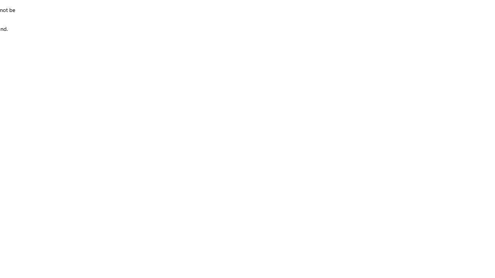

# Gap Registry

Дата актуализации: 2026-09-07. Источники: Product OS 0.5.0 draft и live-аудит 2026-09-04.

## GAP-001

**Название:** Stable deep-link contract

- Статус: confirmed architecture/implementation gap.
- Факт: приложение использует `/app` и hash/internal state, но прямое открытие, reload и browser history не восстанавливают выбранный раздел.
- Решение: path-based или стабильный hash-контракт, проверяемый REQ-005.

### Историческая фиксация 2026-07-27

Первоначально приложение использовало единый защищённый shell `/app` и hash/internal-state navigation:

- `#dashboard`;
- `#workflow`;
- `#shipments`;
- `#tracking`;
- `#crm`;
- `#chats`;
- `#tasks`;
- `#profile`.

`/app/requests` не являлся реализованным маршрутом и возвращал Next.js 404. Это было классифицировано как архитектурный gap, а не самостоятельный High-баг.

Первоначальная оценка влияния: Medium при условии, что hash-раздел стабильно восстанавливается после direct open, reload и Back/Forward.

Доказательства:

- [Production Technical Recon 2026-07-27](audits/2026-07-27-production-technical-recon#real-navigation-model);
- .

### Перепроверка 2026-09-04

Условие безопасного SPA/hash-контракта не выполнено: direct open, reload и browser history не восстанавливают выбранный раздел. Наблюдаемое неправильное поведение отдельно зарегистрировано как BUG-005.

## GAP-002

**Название:** Нет подтверждённого end-to-end Private OS flow

- Статус: release blocker.
- Отсутствует доказанный сценарий request → rates → offer → contract gate → shipment → trip → tracking.
- Решение: REQ-001, REQ-002, REQ-003 и REQ-006.

## GAP-003

**Название:** Tenant isolation и server RBAC не сертифицированы

- Статус: release blocker.
- Одна admin-сессия и UI view switcher не доказывают права клиента, менеджера и логиста.
- Решение: REQ-004/REQ-005, две компании и отдельные accounts.

## GAP-004

**Название:** EXIM Exchange и entitlements не обнаружены в live UI

- Статус: planned product gap, не bug текущей ultra-basic alpha.
- В проверенном live UI не обнаружены listings, Exchange search, responses, selection, free/paid access, profiles и moderation; исходный код не проверялся.
- Решение: REQ-007…REQ-009 и conditional REQ-010 до Public Launch MVP.

## GAP-005

**Название:** Не подтверждена граница private request → public listing

- Статус: architecture/security gap.
- Требуется утверждённая граница; разные сущности, allowlist, явное действие, consent/authority и аудит пока являются рекомендуемым safe default, а не решённой механикой.
- Решение: OQ-038 + REQ-004/REQ-007.

## GAP-006

**Название:** Несоответствующий контейнерный/marketing surface

- Статус: product clarity gap.
- Пустой контейнерный каталог относится к другому продукту; marketing claims не подтверждены источником.
- Решение: OQ-048; подтвердить, скрыть или удалить из текущей навигации отдельным решением.

## Правило

Bug — наблюдаемое неправильное поведение относительно текущего контракта. Gap — отсутствующий продуктовый/архитектурный контур. Отсутствие Exchange в текущей alpha не следует называть техническим дефектом.
